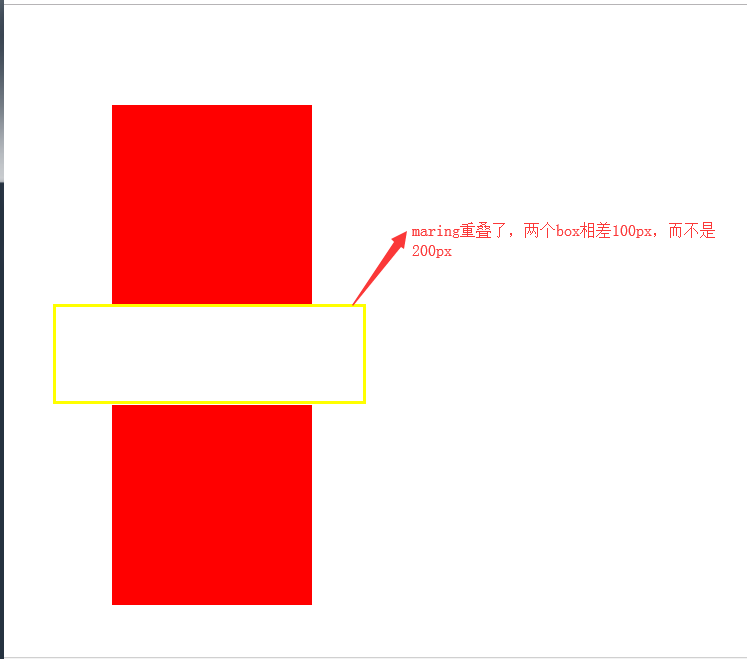
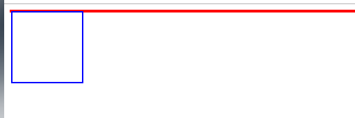
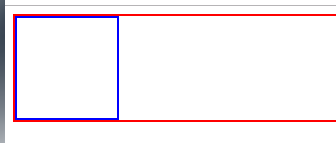
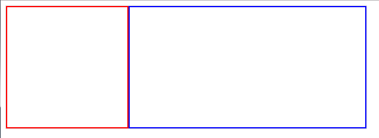

# BFC
## 定义
来自MDN的定义
>块格式化上下文（Block Formatting Context, BFC）是web页面的可视化CSS渲染的一部分，是块盒子的布局过程发生的区域，也是浮动元素与其他元素交互的区域。
通俗的讲，bfc就是一个封闭的箱子，无论内部的元素怎么翻滚，都不会影响外面的元素

## 创建BFC的几种方式
1. html根元素
2. 浮动元素（浮动的值不为none）
3. overflow不为visibile的元素
4. position为absolute和fixed的元素
5. display为inline-block和flex的元素

## BFC的作用
1. 清除浮动
2. 自适应两栏布局
3. 防止margin重叠

## BFC的约束规则
1. 内部的box会在垂直方向上一个接着一个放置
2. 属于同一个BFC的两个相邻Box的margin会发生重叠（塌陷），与方向无关
3. BFC的区域不会与floa的区域重合
4. 计算bfc的区域高度的时候，float子元素也参与计算
5. BFC是一个独立的容器，里面的子元素不会影响外面的元素
6. 每个元素的左外边距与包含块的左边界相接触（从左向右），即使浮动元素也是如此。（这说明BFC中子元素不会超出他的包含块，而position为absolute的元素可以超出他的包含块边界）

## BFC的应用
1. 防止margin重叠（塌陷）
```html
    <html>
        <body>
            <div><div>
            <div><div>
        </body>
    </html>
```

```css
    div {
        width: 200px;
        height: 200px;
        background-color: red
    }
```
html元素可以创建BFC,根据BFC规则的第二条，body下面的两个div属于同一个BFC内，margin会发生重叠（以数值大的margin为准）。结果图如下：
 
 

::: danger
是html可以创建BFC而不是body可以创建BFC，在body下面写一个浮动元素，可以看到body没有高度，而html有高度，说明了是html可以创建BFC
:::

在这个列子中，如果不想发生margin重叠，可以再div的外面再包裹一层，并触发一个新的BFC,这两两个容器不在一个BFC内，就不会发生margin重叠。

2. BFC可以阻止元素被浮动元素覆盖
一个很经典的例子：
```html
    <body>
        <div class="box">
            
            <p>我是一段很长的文字，我是一段很长的文字，我是一段很长的文字，我是一段很长的文字，我是一段很长的文字，我是一段很长的文字，我是一段很长的文字，我是一段很长的文字，我是一段很长的文字，我是一段很长的文字，我是一段很长的文字，我是一段很长的文字，我是一段很长的文字，我是一段很长的文字，我是一段很长的文字，我是一段很长的文字，我是一段很长的文字，我是一段很长的文字，我是一段很长的文字，<p>
        </div>
    <body>
```

```css
    .box {
        width: 400px;
        height: 400px;
        border: 1px solid #ddd;
    }
    img {
        width: 200px;
        height: 200px;
        float: left;
    }
```
根据BFC规则第三点，这时候其实第二个元素有部分被浮动元素所覆盖，(但是文本信息不会被浮动元素所覆盖)，如下图所示：


如果想避免元素被覆盖，可以让第二个元素形成BFC（形成BFC的方法上面已经介绍过啦~~）

3. BFC可以包含浮动的元素（清除浮动）
```html
    <body>
        <div class="parent">
            <div class="child"></div>
        </div>
    </body>
```

```css
    .parent {
        border: 2px solid red;
    }
    .child {
        float: left;
        width: 100px;
        height: 100px;
        border: 2px solid blue;
    }
```
child元素浮动，脱离了文档流，使得父元素高度塌陷，如下图所示：



根据BFC规则第四点，如果父元素触发了BFC,那么他会包含浮动元素（清除浮动），
```css
    .parent {
        border: 2px solid red;
        overflow: hidden;
    }
```
效果如下图所示：



4. 自适应两栏布局

```html
    <div class="content">
        <div class="aside"></div>
        <div class="main"></div>
    </div>
```
```css
    .content {
        width: 600px;
        border: 1px solid #ddd;
    }
    .aside {
        float: left;
        width: 200px;
        border: 2px solid red;
        height: 200px;
    }
    .main {
        overflow: hidden;
        border: 2px solid blue;
        height: 200px;
    }
```
当触发main生成BFC后，这个新的BFC不会与浮动的aside重叠。因此会根据包含块的宽度，和aside的宽度，自动变窄
效果图如下：




