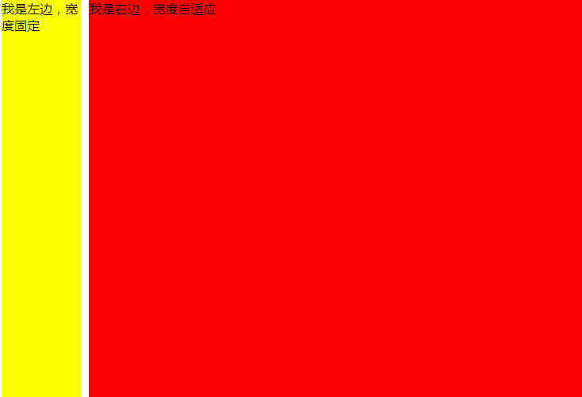

# CSS布局

## 两栏布局

1. float + margin

```html
    <div>
        <div class="left">我是左边，宽度固定</div>
        <div class="right">我是右边，宽度自适应</div>
    </div>
```

```css
    .left {
        float: left;
        width: 100px;
        height: 500px;
        background-color: yellow;
    } 
    .right {
        background: red;
        margin-left: 110px;
        height: 500px;
    }
```
效果图：


2. float + overflow
```html
    <div>
        <div class="left">我是左边，宽度固定</div>
        <div class="right">我是右边，宽度自适应</div>
    </div>
```
```css
    .left {
        float: left;
        width: 100px;
        height: 500px;
        background-color: yellow;
        margin-right: 10px;
    }
    .right {
        background-color: red;
        overflow: hidden;
        height: 500px;
    }
```
效果图：


3. absolute + relative
```html
    <div class="parent">
        <div class="left">我是左边，宽度固定</div>
        <div class="right">我是右边，宽度自适应</div>
    </div>
```
```css
    .parent {
        position: relative;
    }
    .left {
        position: absolute;
        top: 0;
        left: 0;
        width: 100px;
        background: yellow;
        height: 500px;
    }
    .right {
        position: absolute;
        background: red;
        left: 110px;
        right: 0px;
        height: 500px;
    }
```
效果图：


4. flex布局（pc端兼容性不好）
```html
    <div class="parent">
        <div class="left">我是左边，宽度固定</div>
        <div class="right">我是右边，宽度自适应</div>
    </div>
```

```css
     .parent {
            display: flex;
        }
        .left {
            width: 100px;
            height: 500px;
            background: yellow;
            margin-right: 10px;
        }
        .right {
            flex: 1;
            background: red;
            height: 500px;
        }
```
效果图：


## 三栏布局
1. 圣杯布局
```html
    <div class="parent">
        <div class="main">main</div>
        <div class="left">left</div>
        <div class="right">right</div>
    </div>
```

```css
    .parent {
        padding: 0 200px;
        height: 500px;
    }
    .main {
        float: left;
        width: 100%;
        background-color: #ddd;
        height: 500px;
    }
    .left {
        float: left;
        width: 200px;
        background-color: red;
        height: 500px;
        margin-left: -100%;
        position: relative;
        left: -200px;
    }
    .right {
        float: left;
        width: 200px;
        background-color: yellow;
        height: 500px;
        margin-left: -200px;
        position: relative;
        position: relative;
        left: 200px;
    }
```

2. 双飞翼布局
```html
<div class="parent">
        <div class="main">
            <div class="main-content"></div>
        </div>
        <div class="left">left</div>
        <div class="right">main</div>
    </div>
```
```css
    .main {
        float: left;
        width: 100%;
        background: #ddd;
        height: 500px;
    }
    .main-content {
        margin: 0 200px;
        height: 500px;
    }
    .left {
        float: left;
        width: 200px;
        margin-left: -100%;
        background: red;
        height: 500px;
    }
    .right {
        float: left;
        width: 200px;
        margin-left: -200px;
        background-color: yellow;
        height: 500px;
    }
```

