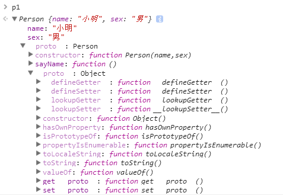

# 原型和原型链
原型以及原型链等相关概念总是离不开构造函数。下面我们先从一个构造函数来看。
## 一、构造函数创建对象
```javascript
    function Person(name,sex) {
         this.name=name;
         this.sex=sex;
    }
    var p1=new Person('小明','男');
    console.log(p1.name);//小明
    console.log(p1.sex);//男
```
通过new 构造函数，创建了一个Person对象。
思考：在new的过程中，整个执行过程是怎么样的？
* 当new一个函数的时候，整个函数会作为构造函数创建一个对象。
* 函数里面的this代表创建的这个对象。给this添加属性就是给构造函数创建的对象添加属性。
* 上述代码的执行过程：
1. 创建一个空对象p1。
2. 执行构造函数，给p1添加属性。所以p1是一个对象（Person(name:'小明'，'男')）
## 二、原型
在以上构造函数上，加一方法
```javascript
      function Person(name,sex) {
          this.name=name;
          this.sex=sex;
      }
      Person.prototype.sayName=function() {
         console.log(this.name);
      }
      var p1=new Person('小明','男');
      p1.sayName();//小明。
```
在上面的例子中，出现了prototype这个东西，这个东西就和我们所说的原型有关。下面对原型来谈谈原型。
* 任何函数在声明之后有一个prototype这个属性。其值是一个对象。


* 对象里面有个__proto__隐藏属性，指向构造函数的原型对象。(p1.__proto__===Person.prototype)
* 当访问对象的属性时先从对象本身里找，找不到再从原型对象里找。
下面我们画出上面代码的原型图，以便更好的理解。


在上面的代码中我们p1中没有sayName这个方法，在原型对象里找到了sayName这个方法。
## 三、 constructor
还是上面的例子，上面我们说了Person.prototype里面有个一个constructor属性，那这个属性是什么勒？
* constructor指向对象的创造者。即Person.prototype.constructor===Person。
因为Person.prototype===p1.__proto__
因此有p1.__proto__.constructor===Person。
## 四、 原型链，有了上面的知识，下面我们可以开始来看看原型链了
```javascript
 function Person(name,sex) {
          this.name=name;
          this.sex=sex;
      }
      Person.prototype.sayName=function() {
          console.log(this.name)
      }
      var p1=new Person('小明','男')
       p1.sayName();
       p1.toString();
```
通过上面的原型分析，我们知道了p1的sayName方法来自其原型对象。那toString来自哪里勒？我们上面并没有在其原型对象上绑定toString方法。
对象是由函数new出来的，那Person.prototype这个对象是由什么函数创建而来的？
* 我们来看一下原型链的取值图


可以发现Person.prototype这个对象是由object创建的
* 通过原型链取值图画出原型链图

      

通过这个图，我们就知道toSring是由哪来的。
以上就是我对原型知识的一些理解。