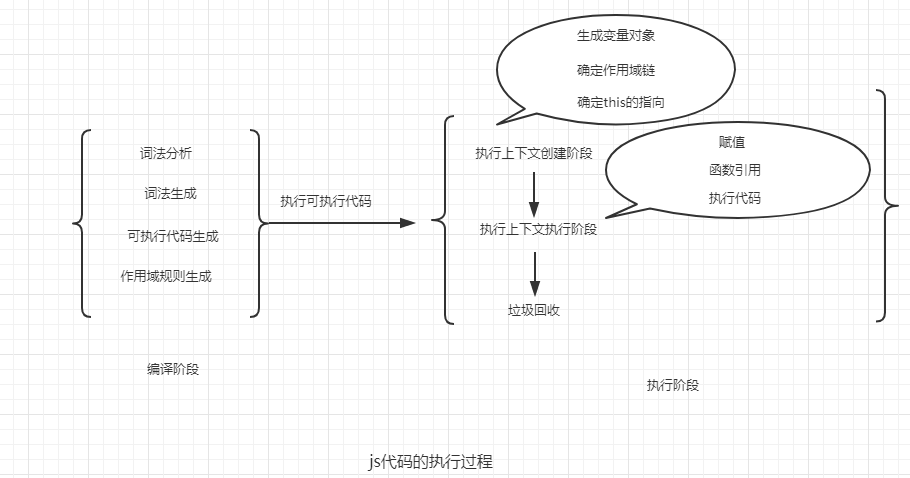

# 作用域和作用域链

## JS代码的执行过程
JS代码执行的时候分为两个阶段：
1. 代码编译阶段，编译阶段由编译器完成。将代码翻译成可执行代码，这个阶段作用域规则会确定。
2. 代码执行阶段，执行阶段由引擎完成，主要任务是执行可执行代码，执行上下文在这个阶段创建。代码执行阶段又分为两个阶段：也就是我们之前说的执行上下文的创建阶段和执行阶段。

## 作用域
作用域规定了如何查找变量，也就是确定当前执行代码对变量的访问权限，作用域采用的词法作用域（静态作用域），**也就是说作用域是在函数定义的时候确定的**。函数内部保存了一个[[scope]]属性，当函数创建时，就会保存所有父变量对象到[[scope]]中，可以理解 [[scope]] 就是所有父变量对象的层级链。但是[[scope]]并不是完整的作用域链。

```javascript
var value = 1;
function foo() {
    console.log(value);
}
function bar() {
    var value = 2;
    foo();
}
bar(); // 1
```
执行bar，foo函数打印出来的是1，执行foo的时候先看foo内部是否有定义value，如果没有就从它定义的上一层去找，找到value为1。

::: tip
不要把js的作用域和执行上下文弄混了，作用域是是在js代码的代码编译阶段确定的（此时代码还没有执行），而执行上下文是在代码的执行阶段才产生的。
:::
## 作用域链
作用域链，是由当前环境与上层环境的一系列变量对象组成，它保证了当前执行环境对符合访问权限的变量和函数的有序访问。
当函数执行的时候，进入执行上下文创建阶段，变量对象和作用域链都会被确定。创建了VO后，VO会被添加到作用域的最顶端。形成了作用域链，至此，作用域链创建完毕。
```javascript
    Scope = VO.concat([[scope]])
```
## 完整的分析变量对象和作用域的创建过程

```javascript
var a = 20;
function test() {
    var b = a + 10;
    function innerTest() {
        var c = 10;
        return b + c;
    }
    return innerTest();
}
test();
```
1. 执行全局代码，进入全局上下文（globalEcs）。


        globalEcs: {
            VO: {
                a: undefined,
                test: <test reference> 
            }
        }
2. 全局上下文进入执行阶段。VO（global）变AO（global），执行test,进入test执行上下文（testEcs）创建阶段。


        globalEcs: {
            AO: {
            a: 20,
                test: <test reference> 
            }
        }

        testEcs: {
            VO: {
                b: undefined,
                innerTest: <reference>
            },
            Scope: [VO, globalEcs.AO]
        }  
3. 进入test上下文执行阶段，执行innerTest，进入innerTest执行上下文（innerTestEcs）创建阶段。


        globalEcs: {
            AO: {
                a: 20,
                test: <test reference> 
            }
        }

        testEcs: {
            AO: {
                b: 30,
                innerTest: <reference>
            },
            Scope: [VO, globalEcs.AO]
        }

        innerEcs: {
            VO: {
                c: undefined,
            },
            Scope: [VO, testEcs.AO, globalEcs.AO]
        }

4. 进入innerTest执行上下文（innerTestEcs）执行阶段，执行代码，完成赋值，通过作用域链，早到b,c的值，所以最后innerTest执行的结果是40。

        
        innerEcs: {
            AO: {
                c: undefined,
            },
            Scope: [AO, testEcs.AO, globalEcs.AO]
        }
