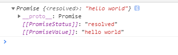

# async和await

## async

### 定义
来着MDN的定义：
> async function用来定义一个返回AsyncFunction对象的函数，异步函数是指通过事件循环异步执行的函数，他会通过一个隐形的Promise返回一个结果，如果你在代码中使用了异步函数，你会发现他的语法和结果更像是标准的同步函数。

### 用法
 作为一个关键词放在函数名的前面，返回一个Promise对象

 ```js
    async function test() {
        return 'hello world'
    }
    const result = test()
    console.log(result)
 ```
以上通过一个async定义了一个test函数，执行test函数，打印出执行结果如下：


关于返回的Promise对象，有如下需要注意的点;
* 执行函数时会调用Promise.reslove()把它转换成Promise并返回，如果async有返回值，则将返回值传入到resolve中
* 如果函数内部出错，则会调用Promise.reject()返回一个Promise对象。

要想获得async函数返回得值，就要调用Promise的then或catch注册的回调函数。

## await

### 定义
来自MDN的定义：
>await操作用于等待一个Promsie对象，它只能在异步函数async function中使用

:::danger
    await只能在async中使用
:::

### 用法

await后面跟着一个Promise对象或者要等待的值，返回Promise对象的处理结果，如果等待的不是Promise对象，则返回其本身。

await有一个特定会暂定当前async函数的执行，等待Promise处理完成，Promise处理完成后，继续执行async函数

```js
    function timeout(value) {
        return new Promise((resolve, reject) => {
            setTimeout(() => {
                resolve(value)
            }, 2000)
        })
    }

    async function test() {
        const result = await timeout(1)
        const result1 = await 123
        console.log(result1) // 123,等待的不是Promise对象，返回其本身
        console.log(result) // 等待的是Promise对象，返回Promsie对象的处理结果
    }

    test()
```


