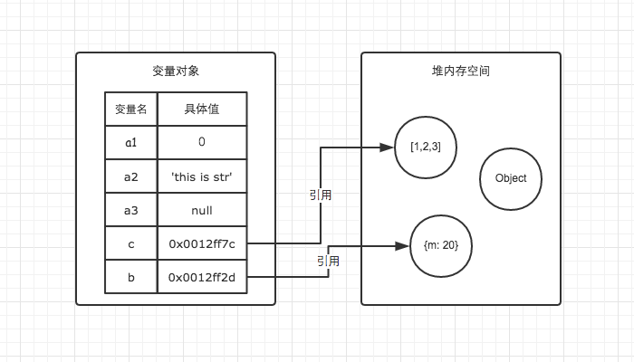
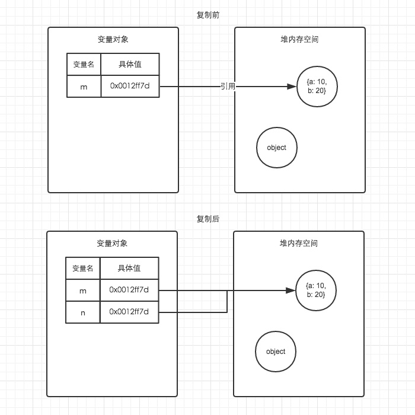

# JS内存空间
## 数据结构类型
计算机中有以下三种数据结构：
* 栈（特点：先进后出，典型例子：执行上下文栈）
* 队列（先进先出，理解队列对于理解事件循环有很大的帮助）
* 堆（好比在JSON格式的数据中，我们存储的key-value是可以无序的），引用数据类型存在堆内存中。

## 数据类型和数据结构的联系
JS数据类型分为两大类，基本数据类型和引用数据类型。
### 基本数据类型
基本数据类型有以下6种:
1. Number
2. String
3. Bollean
4. Null
5. Undefined
6. Symbol（es6中新增）

基本数据类型保存在栈内存中，占用的大小和空间固定。是按值访问的。

### 引用数据类型

Object,Array,Function,Date等这些都是引用数据类型，引用数据类型占用的空间和大小都不固定。存储在栈中会影响性能。引用数据类型在栈中存储了指针。而引用数据类型的值是存储再堆内存中。JS是不允许直接操作堆内存中的值的。因此引用数据类型是按引用传递的。在操作对象时，实际上是在操作对象的引用而不是实际的对象。
通过下面一些例子来了解变量对象和堆内存。

::: tip
引用类型在栈中存储了指针，引用类型的值存储在堆内存中，当解释器寻找引用值时，会首先检索其在栈中的地址，取得地址后从堆中对象的值。
:::


## 举例说明及图解

```javascript
    var a1 = 0;   // 基本数据类型
    var a2 = 'this is string'; // 基本数据类型
    var a3 = null; // 基本数据类型
    var b = { m: 20 }; // 变量b存在于变量对象中，{m: 20} 作为对象存在于堆内存中
    var c = [1, 2, 3]; // 变量c存在于变量对象中，[1, 2, 3] 作为对象存在于堆内存中
```

因此当我们要访问堆内存中的引用数据类型时，实际上我们首先是从栈中获取了该对象的地址引用。


```javascript
    var m = { a: 10, b: 20 }
    var n = m;
    n.a = 15;
    m.a ? // 15 
```


在把m赋值给n的时候，把m的指针赋值给了n，所以m和n指向同一个对象，当一个改了之后，另一个也跟着改。