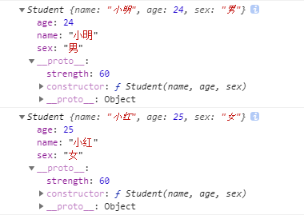
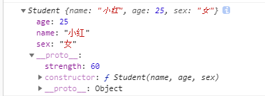

# new的模拟实现
## 定义
来自MDN的定义
>new 运算符创建一个用户定义的对象类型的实例或具有构造函数的内置对象的实例。new 关键字会进行如下的操作。
1. 创建一个空的简单JavaScript对象（即{}）；
2. 链接该对象（即设置该对象的构造函数）到另一个对象 ；
3. 将步骤1新创建的对象作为this的上下文 ；
4. 如果该函数没有返回对象，则返回this。
## new操作符做了什么？
通过一个列子来看new操作符做了哪些事情

```javascript
    function Student(name, age, sex) {
        this.name = name
        this.age = age
        this.sex = sex
    }
    Student.prototype.strength = 60
    var s1 = new Student('小明', 24, '男')
    var s2 = new Student('小红', 25, '女')
    console.log(s1)
    console.log(s2)
```

s1、s2的结果如下图所示：



通过上述例子我们可以看出：
1. s1、s2是对象。
2. 访问到了Student上面的属性。
3. 访问到了Student原型上面的属性和方法。

由此我们得知new做了以下几件事：
1. 创建了一个对象。
2. 让对象拥有构造函数里的属性。
3. 让对象能够返回单构造函数原型上面的属性。
4. 返回对象。

## 模拟实现
根据new操作做的事情，我们通过一个函数来模拟一下new的实现。
首先明确一下调用方式objectFactory(Student, '小明', 24)

```javascript
    function objectFactory() {
        const obj = new Object()
        const Constructor = [].shift.call(arguments) // 拿到传入进来的第一个参数（构造函数）
        console.log(arguments)
        Constructor.call(obj, ...arguments) // 将构造函数的this指向obj。这样obj就能访问到构造函数上面的属性。
        obj.__proto__ = Constructor.prototype // 将对象的__proto__属性指向构造函数的原型。这样对象就可以访问到构造函数原型上面的属性了。
        return obj
    }
```

用之前的例子测试一下这个函数

```javascript
    function Student(name, age, sex) {
        this.name = name
        this.age = age
        this.sex = sex
    }
    Student.prototype.strength = 60
    var s1 = objectFactory(Student, '小红', 25, '女')
    console.log(s1)
```
s1的结果如下图所示：


可以看到这和new的结果是一样的。
::: danger
当构造函数中有返回值时，通过new操作符new出来的对象只能访问到返回值里面的属性。
:::

有返回值的情况：
```javascript
    function objectFactory() {
        const obj = new Object()
        const Constructor = [].shift.call(arguments) // 拿到传入进来的第一个参数（构造函数）
        const result = Constructor.call(obj, ...arguments) // 将构造函数的this指向obj。这样obj就能访问到构造函数上面的属性。
        obj.__proto__ = Constructor.prototype // 将对象的__proto__属性指向构造函数的原型。这样对象就可以访问到构造函数原型上面的属性了。
        return typeof result === 'object' ? result : obj
    }
```
至此，new的模拟实现已完成。