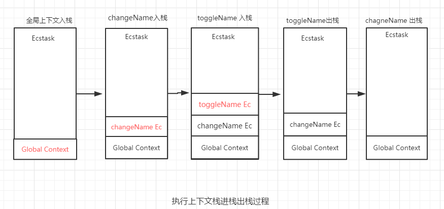

# 执行上下文栈
在javascript执行可执行代码的时候，就会给相应的可执行代码创建一个执行上下文。这样就会出现很多个执行上下文。javaScript 引擎创建了执行上下文栈（Execution context stack，ECS）来管理执行上下文。之前说过数据结构。这种执行上下文栈采用的就是栈数据结构（先进后出）。

::: danger
正是因为执行上下文栈采用的是栈数据结构。栈底永远都是全局上下文，而栈顶就是当前正在执行的上下文。
:::

## 通过代码分析执行上下文栈的进栈和出栈问题
```javascript
var name = '小红';
function changName() {
    var anotherName = '小明';
    function toggleName() {
        var tempName = anotherName;
        anotherName = name;
        name = tempName;
    }
    toggleName();
}
changName();
```

1. 首先进入到全局代码，创建一个全局上下文。把全局上下文加入到全局上下文栈中。
2. 全局上下文入栈之后。里面的可执行代码chagneName执行，创建chagneName上下文，将changeName上下文加入到执行上下文栈中。
3. 进入changeName执行上下文后，里面的可执行代码toggleName执行。创建toggleName执行上下文。将toggleName上下文加入到上下文栈中。
4. 进入toggleName执行上下文后，toggleName执行上下文栈没有遇到可执行的代码。执行完toggleName后，toggleName执行上下文出栈。
5. 继续执行changeName的代码，没有遇到其他的执行上下文。changeName执行完毕。chagneName出栈。
6. changName出栈后。这是栈中只剩下全局上下文栈。全局上下文栈在浏览器关闭后出栈。

## 执行上下文进栈出栈图解
