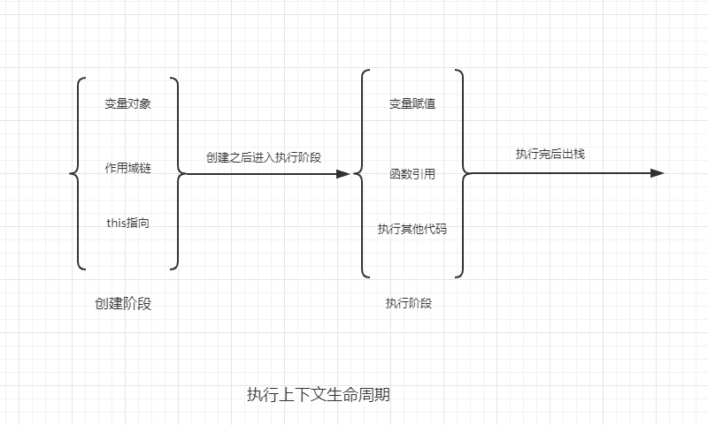

# 执行上下文

## 什么是执行上下文
javascript执行一段可执行代码的时候，会创建一个执行上下文（execution contex），执行上下文可以说是当前代码的执行环境。可执行代码包括以下三种：
1. 全局代码
2. 函数
3. eval代码
也就是说执行这三种代码的时候，会产生执行上下文。

::: tip
执行上下文是在代码执行的时候才产生的。不是定义的时候产生的。
:::

## 执行上下文的生命周期
执行上下文分为两个生命周期：
1. 准备阶段（创建阶段）：在这个阶段会创建变量对象、确定作用域链、确定this的指向。
2. 代码执行阶段：创建阶段完成后，才会执行代码，在这个阶段主要完成赋值、函数的引用、执行其他代码。

::: tip
在执行上下文的创建阶段，是确定作用域链，而不是作用域，作用域是在函数创建的时候确定的。不是在执行的时候确定的
:::

