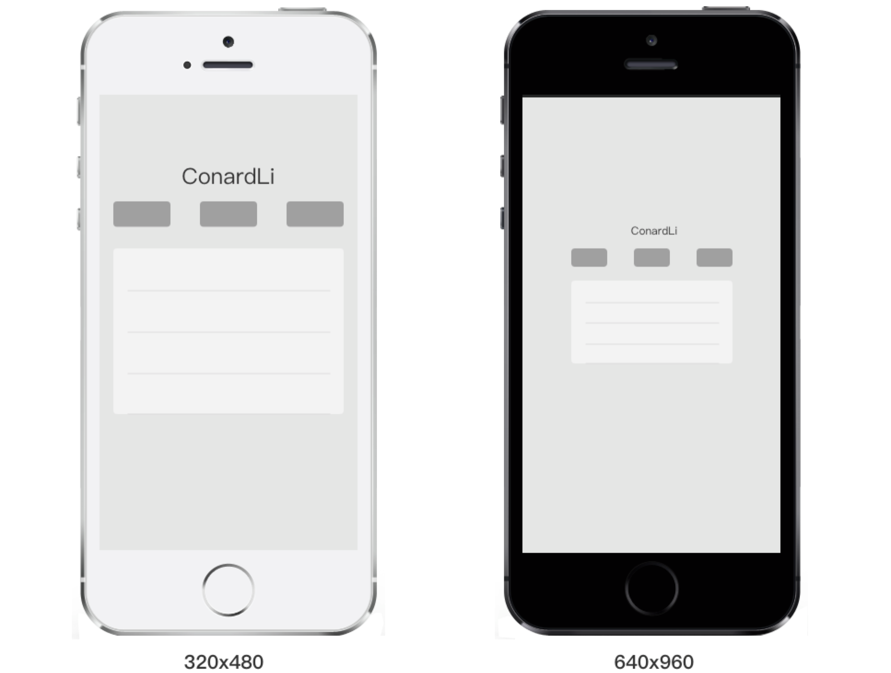

# 移动端适配

## 一些基本概念

### 英寸
英寸用来描述屏幕尺寸的大小，指的是屏幕对角线的长度

### 像素
组成一幅图像的全部亮度和色度的最小单位

### 分辨率
屏幕分辨率是指纵横向上的像素点数，单位是px。屏幕分辨率确定计算机屏幕上显示多少信息的设置，以水平和垂直像素来衡量。就相同大小的屏幕而言，当屏幕分辨率低时（例如 640 x 480），在屏幕上显示的像素少，单个像素尺寸比较大。屏幕分辨率高时（例如 1600 x 1200），在屏幕上显示的像素多，单个像素尺寸比较小。
:::danger
通常我们说的分辨率有两种，一种是屏幕分辨率，一种是图像分辨率
:::

#### 屏幕分辨率
屏幕分辨率是指一个屏幕由多少个像素点组成，如iphone6的分辨率为750 * 1334,表示手机在垂直和水平方向上的像素点。

#### 图像分辨率
图片分辨率是指图片还有的像素数，比如一张图片的分辨率为600 * 400，表示图片在垂直和水平方向上的像素点

#### PPI
ppI指的是每英寸的包含的像素数


:::danger
PPI越高，屏幕和图像更加清晰
:::

### 设备独立像素（逻辑像素）
上面我们所说的都是物理像素，是真正的物理单元。为什么会产生设备独立像素（单位：pt）了。

随着智能手机的快速发展，低分辨率的手机已经满足不了我们的需求，越来越多高分辨率的手机出现了，如下图所示：


白色手机的物理分辨率（设备分辨率）为320 * 640，黑色手机的分辨率是640 * 960，从理论上讲相同的文字和图片大小，在黑色手机上会缩小一倍，因为它的分辨率比白色手机提高了一倍。如果是这样的话，岂不是分辨率更高的手机，页面元素会变得越来越小。
然而，并不是这样的，乔布斯在iPhone4的发布会上首次提出了Retina Display(视网膜屏幕)的概念，它正是解决了上面的问题，这也使它成为一款跨时代的手机。

如果黑色手机使用了视网膜屏幕，比如某个元素的宽度为300个像素，白色手机会用300个像素去渲染它，而黑色手机会用600个像素去渲染它。

这样的话我们必须要一个统一的单位来告诉不同分辨率的手机，他们在界面上显示的元素大小是多少，这个单位就是设备独立像素（DP），在Chrome浏览器的开发者工具上每个手机型号会显示型号，这个型号就是设备独立像素。

#### 设备像素比
设备像素比（dpr） = 物理像素 / 设备独立像素

* 在web中，可以通过**window.devicePixelRatio** 来获取dpr

* 在css中，可以使用媒体查询**min-device-pixel-ration**来区分dpr
```css
    @media (-webkit-min-device-pixel-ratio: 2),(min-device-pixel-ratio: 2){ }
```

## 移动端开发

在移动端开发中，我们的设计稿一般是给750的设计稿，这个750说的是物理像素。而我们在写css时，一般要写设备独立像素，所以在写css时的真正的高度和宽度为**设计稿的宽度（高度）/ 设备像素比**

## 移动端适配方案
我们用设备独立像素来保证不同的手机分辨率的手机显示效果类似，但是并不能保证他们完全一样，所以需要一种方案让设计稿更好的适配，

### 淘宝适配方案flexible


